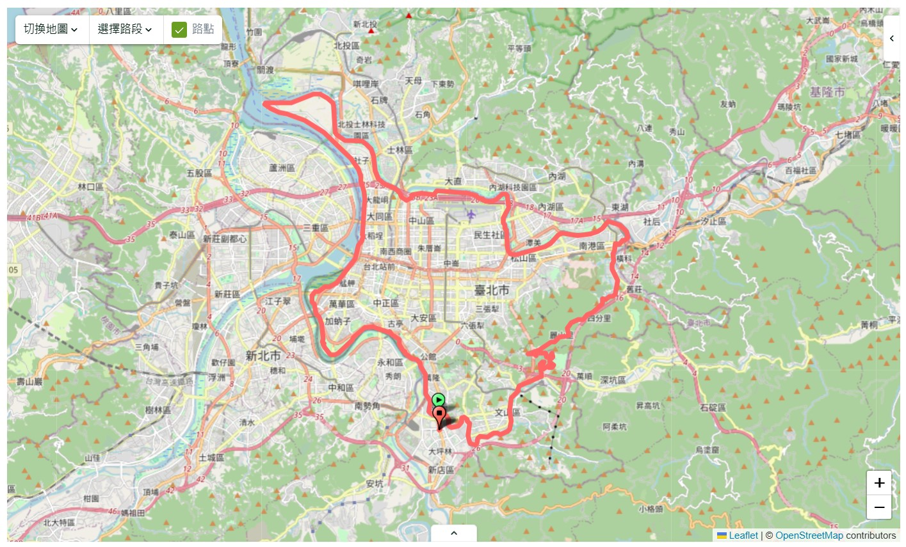
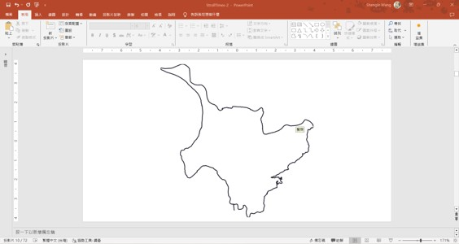

## About

I often go hiking in the mountains and cycling, and I frequently need to share this information. Using software like [Google Maps' personal maps](https://www.google.com/maps/about/mymaps/) or [HIKINGNOTE](https://hiking.biji.co/) to display GPX files is a good choice. However, for further graphical presentation, editing, and marking, it can be time-consuming. Therefore, this program converts GPX data into SVG format to facilitate enhanced presentation and use. SVG, being lossless, is also well-suited for use in presentations like PowerPoint.


*Note: This image shows an actual GPX file from Cycling Circle Trip Taipei, saved and shared using hiking notes.*

## Usage

1. First, install the modules `gpxpy`, `svgwrite`, and `geopy`:

   ```bash
   pip install gpxpy svgwrite geopy
   ```
2. Run the script, where you can specify the GPX file, output location, GPX scale, and SVG line thickness:
    
3. You can use it in image editing software or presentation tool.This Markdown format organizes your content with headings, images, and code blocks, making it suitable for a README.md file.
    

## Contact
- SHENGLE
- [撰風旅食:旅遊美食分享](https://jfsblog.com/)
- [漫步時光:全台活動資訊整理](https://strolltimes.com/)

